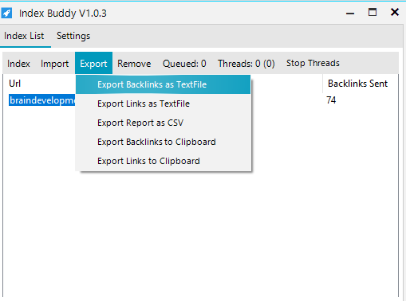

### **Export**

|Function | Description
--- | ---
|Export Backlinks as TextFile | Export all created Backlinks as TextFile (.txt).
|Export Links as TextFile| Export all URLs inside the *Index List* as TextFile (.txt).
|Export Report as CSV| Export a indexing report as CSV/Excel sheet.
|Export Backlinks to Clipboard | Export all created Backlinks to the clipboard.
|Export Links to Clipboard| Export all URLs inside the *Index List* to the clipboard.

Export file dialog

Select if only selected URLs inside the *Index List* should be exported.

Select if the Excel US or EU default splitting char should be used.

Backlink Indexing Report