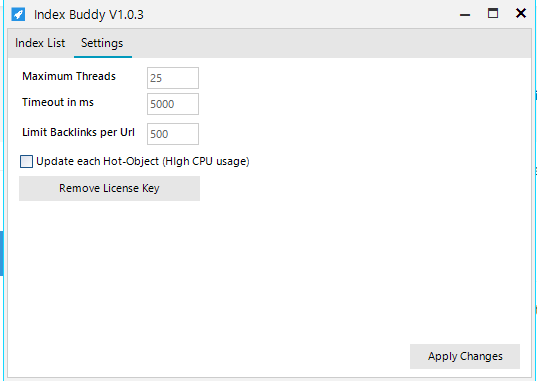
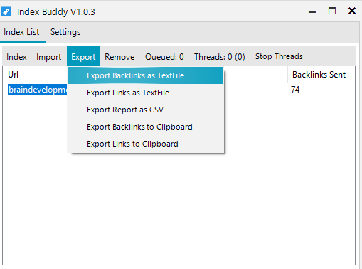
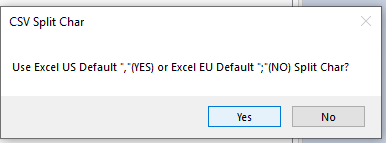
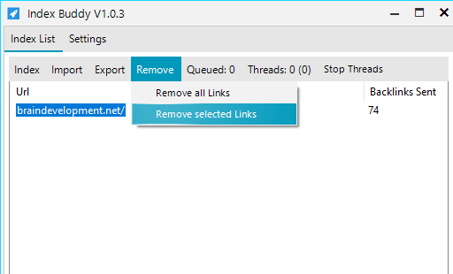

## Quick Start
1. *Import* the URLs you want to index.
2. *Adjust* the settings to your needs.
3. *Run* the indexing process.
4. *Export* the resulting backlinks.

## Import
In order to index URLs, the first has to be imported into Index Buddy.
URLs can either be imported from the clipboard or from a text file by pressing on the *Import* tab as shown below.

|Function | Description
--- | ---
|Import URLs from File | Import URLs you want to index from a textfile. One URL has to be in one single line.
|Import URLs from Clipboard | Imports URLs from clipboard (copied URLs). One URL has to be in one single line.

## Settings
On the *Settings* tab several software parameters can be adjusted. The settings tab can be found in the top menu on the left side. In order to apply the changes, the *Apply Changes* button in the bottom right corner must be pressed.

|Setting | Default | Description
--- | --- | ---
|Maximum Threads|25|Set the maximum number of working threads. A higher threadcount is usually faster but also requieres more system resources.
|Timeout in ms|5000 (5s)|The timeout defines the amount of time in milliseconds to wait after a single request will be canceled. If your internet connection is slow it is recommened to increase the timeout to 10000ms (10s).
|Limit Backlinks per URL|500|Limit the maximum number of backlinks to create per URL in order to index it.
|Update every Hot-Object| Unchecked| Display changes to the index list imidiatly.
|Remove License Key| | Set another license key and detele the current license key from the computer.

## Indexing

The indexing process can be started by pressing the *Index* button in the top menu. The *Backlinks Sent* counter will be incremented shortly after a backlink has been successfully created.

|Function | Description
--- | ---
|Index all Links | The indexing process for all URLs inside the *Index List* will be started.
|Index selected Links| The indexing process for selected URLs inside the *Index List* will be started.

## Export
Resulting backlinks or Excel/CSV indexing reports can be generated by pressing the *Export* button on the top menu.

|Function | Description
--- | ---
|Export Backlinks as TextFile | Export all created Backlinks as TextFile (.txt).
|Export Links as TextFile| Export all URLs inside the *Index List* as TextFile (.txt).
|Export Report as CSV| Export a indexing report as CSV/Excel sheet.
|Export Backlinks to Clipboard | Export all created Backlinks to the clipboard.
|Export Links to Clipboard| Export all URLs inside the *Index List* to the clipboard.

### Excel/CSV Export
To export Excel reports in the standard US format, press *YES*.
If you want to export the report in the standard EU format, press *NO.*

## Remove
URLs can be removed from the *Indexing List* by pressing the *Remove* button on the top menu.

|Function | Description
--- | ---
| Remove all Links | Remove all URLs from the *Index List*.
| Remove Selected Links | Only remove selected URLs from the *Index List*.