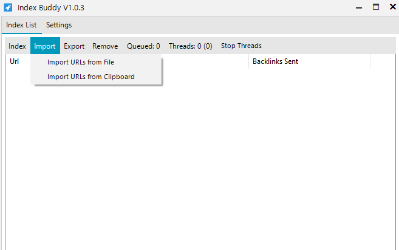

### **Import**
URLs to index can be imported from clipboard or from file.

|Function | Description
--- | ---
|Import URLs from File | Import URLs you want to index from a textfile. One URL has to be in one single line.
|Import URLs from Clipboard | Imports URLs from clipboard (copied URLs). One URL has to be in one single line.