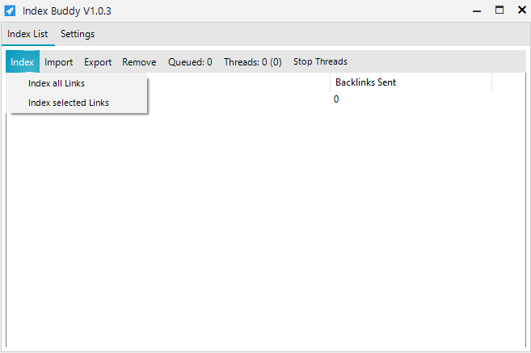

### **Indexing**

|Function | Description
--- | ---
|Index all Links | The indexing process for all URLs inside the *Index List* will be started.
|Index selected Links| The indexing process for selected URLs inside the *Index List* will be started.

After clicking on one of these buttons the indexing process will be started and the backlinks sent counter should increment shortly after. 
