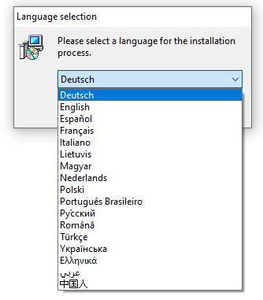
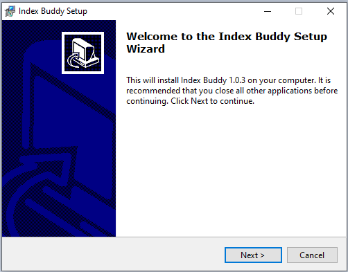
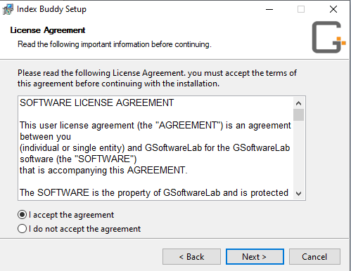
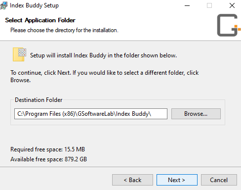
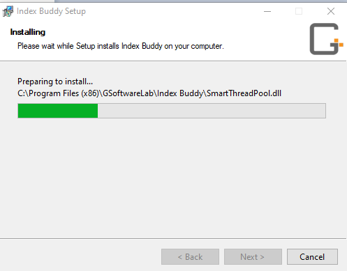

### **Installation**
Download Index Buddy using the link in your order confirmation or from the [customer area](https://gsoftwarelab.com/my-account/downloads/).
Index Buddy **requieres the .Net Framework 4.8** or later. That package can be downloaded from [Microsoft](https://dotnet.microsoft.com/download/dotnet-framework/thank-you/net48-web-installer).

The installation process includes several steps shown in the pictures below.

