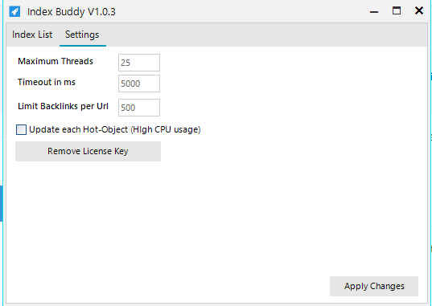

### **Settings**
On the settings tab several parameters can be changed. The settings tab can be found in the top menu on the left side.

|Setting | Default | Description
--- | --- | ---
|Maximum Threads|25|Set the maximum number of working threads. A higher threadcount is usually faster but also requieres more system resources.
|Timeout in ms|5000 (5s)|The timeout defines the amount of time in milliseconds to wait after a single request will be canceled. If your internet connection is slow it is recommened to increase the timeout to 10000ms (10s).
|Limit Backlinks per URL|500|Limit the maximum number of backlinks to create per URL in order to index it.
|Update every Hot-Object| Unchecked| Display changes to the index list imidiatly.
|Remove License Key| | Set another license key and detele the current license key from the computer.

In order to apply made changes the *Apply Changes* button in the bottom right corner must be pressed.
